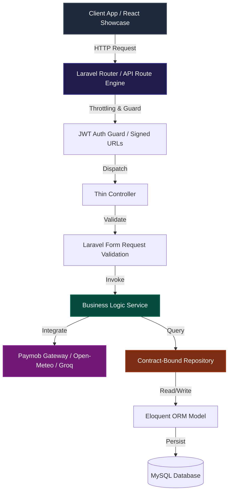

# Itinari — Developer Portal

The official API reference, live sandbox, and system narrative for **Itinari** — an AI-powered luxury travel orchestration platform (Team 2 Conference Project @ Threedos).

> **Verdict:** Production-ready · Laravel 13 · **106/106 reconciled API operations** · live Cloud Mock with realistic datasets

---

## 01 — Overview

Itinari orchestrates luxury travel: destination and flight catalogs, AI-generated itineraries (Groq llama-3.3-70b), trip attachment pipelines, Paymob-hosted checkout with HMAC-verified webhooks, agency marketplace, and an operator admin suite.

This portal documents **106 unique API operations** — every route in `routes/api.php` reconciled against controller implementations, grouped by domain, with request/response examples and pagination headers on all list endpoints.

---

## 02 — Technology Stack

Verified against `composer.json`:

| Layer | Technology |
| :--- | :--- |
| Framework | Laravel 13 · PHP 8.5 |
| Authentication | tymon/jwt-auth ^2.1 · refresh rotation · blacklist on logout |
| Authorization | spatie/laravel-permission — super_admin · admin · agency · user |
| OAuth | laravel/socialite — Google + Facebook (email verification always required) |
| AI | lucianotonet/groq-laravel — llama-3.3-70b, cached + quota-managed |
| Payments | paymob/php-library — intention API · hosted checkout · HMAC webhooks |
| Reports | barryvdh/laravel-dompdf ^3.1 (PDF) · openspout (XLSX) via queued jobs |
| Cache/Queue | predis (redis-ready) · database driver default |
| Spec Source | dedoc/scramble ^0.13 → curated into this Apidog project |

### Live System Architecture



---

## 03 — Frontend Engineering

Two client generations ship in the monorepo:

- **React 19 showcase + legacy client** — the legacy product surface: 355 files, 48+ pages, zero bundler, `tokens.css` design system, GSAP 3.12 choreography, glassmorphic dark theme.
- **React 19 engineering showcase** — this project's presentation layer: Vite + Tailwind 4 + shadcn/ui primitives + GSAP, with a boarding-pass design system and live Apidog-powered data flows.

**Chips:** `React 19` `Vite` `Tailwind 4` `shadcn/ui` `GSAP` `vanilla-js legacy · 355 files`

---

## 04 — Security Model

All guarded routes require a bearer token:

```http
Authorization: Bearer {{jwt_token}}
```

- **Fetch:** `POST /login` or `POST /register` → 1-hour access token.
- **Rotate:** `POST /refresh` (throttled 15/min) invalidates the old token atomically.
- **Webhooks:** `POST /paymob/webhook` verifies HMAC SHA-512 before any state change; idempotent by `merchant_order_id`.

> **Design decision — JWT placement:** the `auth:api` guard is enforced at the **route layer**, never inside controllers. RBAC (Spatie) is declared per-route, so permission changes are grep-able in one file and controllers stay thin. Email verification is always required — OAuth providers are never auto-trusted.

---

## 05 — Data & Reports

- **Engines:** MySQL in production, SQLite for dev/test parity harness — 44 migrations, soft deletes on major entities, polymorphic `trip_items` attaching hotels/flights/dining/attractions to itineraries.
- **Reports:** `POST /admin/reports/generate` queues `GenerateReportJob` → branded **PDF (DomPDF)** or **XLSX (OpenSpout)** with "All Time" defaults; download via `GET /admin/reports/{id}/download`.
- **Seeded realism:** `migrate:fresh --seed` loads 60+ paid orders/payments plus geocoded catalog fixtures for demos.

---

## 06 — Suggested Demo Flow

Eight steps, one narrative:

1. **Register** — `POST /register`
2. **Verify email** — signed link → success page
3. **Explore catalog** — `GET /destinations` with region/search filters
4. **Create trip** — `POST /trips`
5. **AI generate** — `POST /ai/plan` → enriched days[]
6. **Attach items** — flights · hotels · dining → `/attach/{type}`
7. **Checkout** — Paymob hosted → webhook fulfills order
8. **Boarding pass** — printable ticket · review & fork community trips

---

## ⚙️ Core Environments

| Environment | Base URL | Purpose |
| :--- | :--- | :--- |
| **Live Production** | `https://itinari.up.railway.app/api` | Active monorepo API serving real data. |
| **Local Sandbox** | `http://127.0.0.1:8000/api` | Local container environment. |
| **Apidog Cloud Mock** | `https://mock.apidog.com/m1/1364933-1369112-default` | Safe mock gateway serving realistic multi-item datasets. |

## 📡 Live Interactive Sandbox (Try It)

1. Open any endpoint (e.g. `GET /destinations`).
2. Select **Cloud Mock** in the environment dropdown.
3. **Send** → structured multi-item JSON (Santorini, Tokyo, Paris…).
4. For guarded routes: `POST /login` first, copy `token`, then paste into **Bearer Auth** (top-right Auth panel).

---

## 10 — Team

| Role | Focus |
| :--- | :--- |
| Backend Engineering | Laravel · domain services |
| Frontend Engineering | vanilla JS · GSAP motion |
| Integrations | Paymob · Groq · OSM |
| Quality & Verification | PHPUnit · 55 suites |
| DevOps | Docker · Railway |
| Docs & Design | OpenAPI · Apidog · brand |
