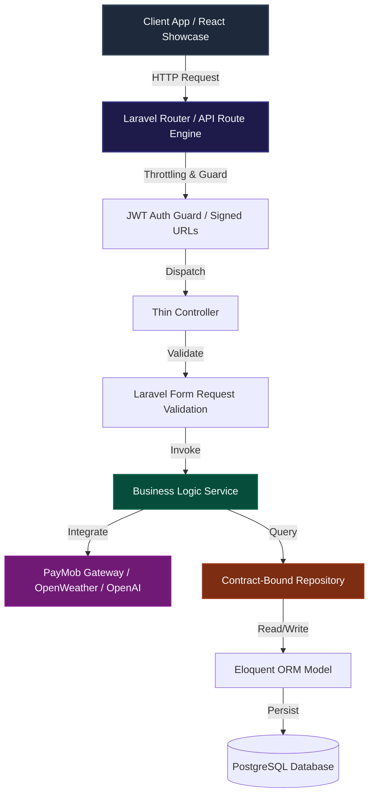

# Itinera API Portal

Welcome to the official developer resources, API reference, and live sandbox portal for **Itinera**—an AI-powered travel orchestration platform. 

This portal provides a unified, production-grade interface for developers to search flights, explore destinations, build travel itineraries, interact with the AI concierge, and clear payments.

---

## 📡 Live System Architecture

The Itinera backend is built on a layered, production-hardened Laravel architecture, decoupling request entry gates from core transactional services and data repositories:



---

## ⚙️ Core Environments & Gateways

When testing APIs or integrating your application, point requests to the appropriate gateway:

| Environment | Base URL | Purpose |
| :--- | :--- | :--- |
| **Live Production Gateway** | `https://itinari.up.railway.app/api` | The active, live monorepo API serving real data. |
| **Local Sandbox Sandbox** | `http://127.0.0.1:8000/api` | Local container environment for development. |
| **Apidog Cloud Mock** | `https://mock.apidog.com/m1/1364933-1369112-default` | Safe, sandboxed mock gateway serving realistic multi-item datasets. |

---

## 🔒 Security & Session Lifecycle

### 1. JWT Bearer Authentication
All guarded resources require a secure JSON Web Token passed in the request header:
```http
Authorization: Bearer {{jwt_token}}
```
* **Fetch Token:** Call `POST /login` with your credentials or `POST /register` to create a new user profile.
* **Token Rotation:** Use the `POST /refresh` endpoint to automatically invalidate the current token and issue a fresh session key.

### 2. PayMob Payment Webhooks
Transactions are verified asynchronously via PayMob. Webhook payloads delivered to `POST /paymob/webhookEndpoint` are validated against an **HMAC Signature** computed using your shared client secret.

---

## 🗂 API Resource Catalog (106 Operations Mapped)

The documentation is organized into clean, domain-grouped directories:

*   📁 **01. Authentication:** Stateless JWT session lifecycles, forgot/reset password flows, and Google/Facebook redirects.
*   📁 **02. Admin Console:** Privileged user control routes (activating, blocking, or creating accounts).
*   📁 **03. Catalog Explorer:** Public search routes for flights, hotels, restaurants, and attractions, featuring **query parameter filters** (`search`, `region`, `limit`).
*   📁 **04. Booking Pipelines:** Custom trip creation, item attachment (flights/hotels to itineraries), and AI itinerary builders.
*   📁 **05. Integrations & Webhooks:** Live weather telemetry coordinates and PayMob billing integration.
*   📁 **06. V1 Compatibility:** Legacy route aliases to support older endpoints.

---

## 📡 Live Interactive Sandbox (Try It)

You can run live API tests directly from this page using the **Try It** interface:

1. Open any endpoint in the API reference list (e.g. `GET /destinations`).
2. Select **Cloud Mock** from the environment dropdown.
3. Click **Send** to instantly receive a structured, multi-item JSON response representing Santorini, Tokyo, and Paris.
4. To test guarded routes, call `POST /login` first, copy the `token` parameter, select **Auth** at the top right of the dashboard, and paste it into the **Bearer Auth** field.
