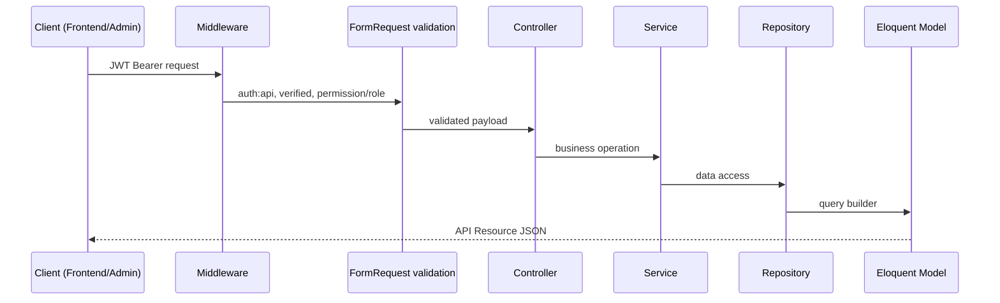
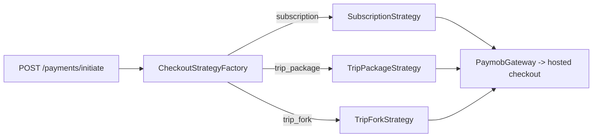

# Architecture Overview

<cite>
- [fullstack/Backend/app/Http/Controllers/Controller.php](file://fullstack/Backend/app/Http/Controllers/Controller.php)
- [fullstack/Backend/app/Providers/AppServiceProvider.php](file://fullstack/Backend/app/Providers/AppServiceProvider.php)
- [fullstack/Backend/app/Strategies/Checkout/CheckoutStrategyFactory.php](file://fullstack/Backend/app/Strategies/Checkout/CheckoutStrategyFactory.php)
- [fullstack/Backend/app/Interfaces](file://fullstack/Backend/app/Interfaces)
- [fullstack/Backend/routes/api.php](file://fullstack/Backend/routes/api.php#L56-L58)
</cite>

## Table of Contents

1. [Layered Request Flow](#layered-request-flow)
2. [Domain Modules](#domain-modules)
3. [Repository & Service Pattern](#repository--service-pattern)
4. [Checkout Strategy Pattern](#checkout-strategy-pattern)
5. [Event-Driven Side Effects](#event-driven-side-effects)
6. [Authorization Model](#authorization-model)

## Layered Request Flow

Every response is shaped through `app/Http/Resources/*` transformers and the shared `Support/ApiResponse` helper for consistent envelopes.

**Diagram sources:** [routes/api.php](file://fullstack/Backend/routes/api.php#L60-L90), [Resources](file://fullstack/Backend/app/Http/Resources), [ApiResponse.php](file://fullstack/Backend/app/Support/ApiResponse.php)

## Domain Modules

The `app/` tree is partitioned by bounded context instead of technical type at the top level:

| Module | Models | Controllers | Services |
|---|---|---|---|
| **Account** | `User`, `Role`, `UserPoint` | Auth, AdminUser | UserService |
| **Catalog** | Country, Region, Destination, Hotel, Flight, Restaurant, Attraction, Category | public + Admin CRUD pairs | per-entity services + Fixtures + AiAttraction |
| **Trips** | Trip, ItineraryItem, TripDestination, Review, Favourite, AiGeneration, BudgetSnapshot, TripContribution | Trip, AI, Map, Interaction, admin variants | TripService, ForkService, AttachService, ReviewService, AiUsage |
| **Commerce** | Order, OrderItem, Payment, Plan, Subscription, Address, AgencyAssignment | Checkout, Paymob, Plan, Agency, Analytics | CheckoutService, PaymobGateway/Client, WebhookService, PriceCalculator, strategies |
| **Chat** | Conversation, Message | ConversationController | — (policy-guarded) |
| **System** | Setting, Flag, Survey, ContactMessage, NewsletterSubscriber, Notification, Report, PasswordResetToken | Weather, Report, Settings, Survey, Contact, Flags, Dashboard | GenerateReportService (+Excel), OpenMeteo, Newsletter, Survey, Flag |

**Section sources:** [app/Models tree](file://fullstack/Backend/app/Models), [Controllers tree](file://fullstack/Backend/app/Http/Controllers)

## Repository & Service Pattern

- Interfaces live in `app/Interfaces/<Module>/` (e.g. [`PaymentGatewayInterface`](file://fullstack/Backend/app/Interfaces/Commerce/PaymentGatewayInterface.php)) and are bound to implementations in `AppServiceProvider`.
- Repositories in `app/Repositories/<Module>/` encapsulate Eloquent queries so services stay persistence-agnostic.
- Controllers stay thin: validate via `FormRequest`, delegate to one service, return a Resource.
- Domain exceptions (`InvalidStateTransitionException`) funnel through a custom [`ApiExceptionHandler`](file://fullstack/Backend/app/Exceptions/ApiExceptionHandler.php) for uniform error payloads.

**Section sources:** [Interfaces](file://fullstack/Backend/app/Interfaces), [Repositories](file://fullstack/Backend/app/Repositories), [AppServiceProvider.php](file://fullstack/Backend/app/Providers/AppServiceProvider.php)

## Checkout Strategy Pattern

`CheckoutType` enum drives factory selection; each strategy builds order lines and pricing before delegating to the single payment gateway. Adding a purchasable product type = one new strategy class.

**Diagram sources:** [CheckoutStrategyFactory.php](file://fullstack/Backend/app/Strategies/Checkout/CheckoutStrategyFactory.php), [Strategies](file://fullstack/Backend/app/Strategies/Checkout), [Support/Enums/CheckoutType.php](file://fullstack/Backend/app/Support/Enums/CheckoutType.php)

## Event-Driven Side Effects

| Event | Listener(s) | Effects |
|---|---|---|
| `PaymentSucceeded` | `FulfillOrderListener` | mark order paid, fire mail + notification, subscription activation |
| `PaymentFailed` | `HandlePaymentFailed` | failure mails/notifications, state rollback |
| `MessageSent` | conversation notifications | chat unread counts |
| Commerce agency events (`AgencyAssignment*`) | admin/user notifications | marketplace workflow |

Mail classes (`TripBookedMail`, `WelcomeMail`, `SubscriptionActivatedMail`, …) and database notifications (`app/Notifications`) keep user-facing messaging decoupled from controllers. Long-running work (report PDF/XLSX generation, destination geocoding) runs on queued jobs: `GenerateReportJob`, `GeocodeDestinationJob`.

**Section sources:** [Events/Commerce](file://fullstack/Backend/app/Events/Commerce), [Listeners](file://fullstack/Backend/app/Listeners), [Jobs](file://fullstack/Backend/app/Jobs), [Mail](file://fullstack/Backend/app/Mail)

## Authorization Model

Two stacked gates on every protected route:

1. **JWT authentication** (`auth:api`) + optional `verified` email gate and custom `EnsureUserIsActive` middleware.
2. **Spatie permissions** via inline middleware: `permission:manage hotels`, `role:admin|super_admin`, etc. Permissions are seeded by `RoleAndPermissionSeeder`; policies exist for fine-grained cases (`TripPolicy`, `ConversationPolicy`, `FlagPolicy`, `AgencyAssignmentPolicy`).

Roles in use: `super_admin`, `admin`, `user`, `agency` (agency marketplace endpoints under `/agency/*`).

**Section sources:** [routes/api.php](file://fullstack/Backend/routes/api.php#L100-L106), [Policies](file://fullstack/Backend/app/Policies), [Middleware](file://fullstack/Backend/app/Http/Middleware)
