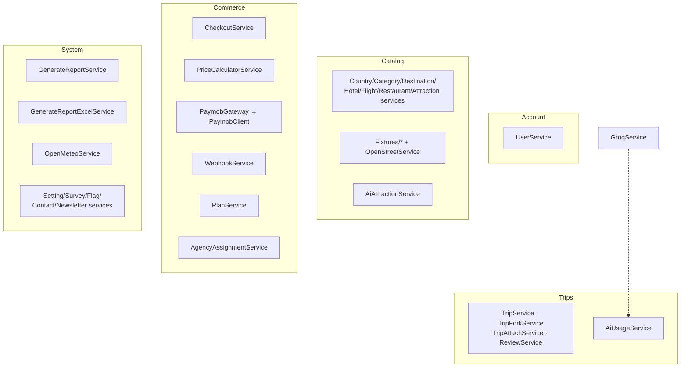
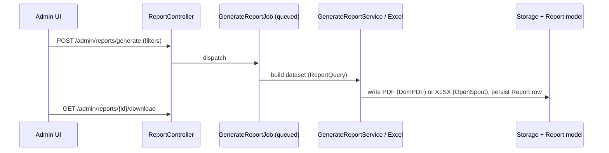

# Backend Services

<cite>
- [fullstack/Backend/app/Services/GroqService.php](file://fullstack/Backend/app/Services/GroqService.php#L18-L60)
- [fullstack/Backend/app/Services/Commerce](file://fullstack/Backend/app/Services/Commerce)
- [fullstack/Backend/app/Services/System/GenerateReportService.php](file://fullstack/Backend/app/Services/System/GenerateReportService.php)
- [fullstack/Backend/app/Services/OpenMeteoService.php](file://fullstack/Backend/app/Services/OpenMeteoService.php)
- [fullstack/Backend/app/Console/Commands](file://fullstack/Backend/app/Console/Commands)
</cite>

## Table of Contents

1. [Service Catalogue](#service-catalogue)
2. [AI Services (Groq)](#ai-services-groq)
3. [Commerce & Payments](#commerce--payments)
4. [Reporting Pipeline](#reporting-pipeline)
5. [Weather Service](#weather-service)
6. [Fixture & Seeding Services](#fixture--seeding-services)
7. [Jobs, Listeners, Mail, Notifications](#jobs-listeners-mail-notifications)
8. [Console Commands](#console-commands)

## Service Catalogue

**Diagram sources:** [app/Services tree](file://fullstack/Backend/app/Services)

## AI Services (Groq)

[`GroqService`](file://fullstack/Backend/app/Services/GroqService.php#L18-L60) wraps `lucianotonet/groq-laravel`:

- `enhance(string $content)` — text enhancement with temperature 0.5; failures are logged and rethrown as a user-safe `RuntimeException`.
- `generateAi(AiTripRequest $request)` — full itinerary synthesis from destination country, budget tier and interests.
- AI review endpoints (`AIController::review`) feed trip JSON to the LLM for automated feedback.
- **Quota enforcement:** every call routes through [`AiUsageService`](file://fullstack/Backend/app/Services/Trips/AiUsageService.php); counters live in Redis/cache and surface at `GET /me/ai-quota`. Rate limiting adds `throttle:ai` on top.

Config: `config('groq.model')`, default `llama-3.1-8b-instant` ([services.php#L59-L62](file://fullstack/Backend/config/services.php#L59-L62)).

**Section sources:** GroqService.php, [Trips/AIController.php](file://fullstack/Backend/app/Http/Controllers/Trips/AIController.php)

## Commerce & Payments

| Concern | Implementation |
|---|---|
| Checkout entry | `POST /payments/initiate` → `CheckoutController::initiate` with `InitiateCheckoutRequest` |
| Strategy selection | [`CheckoutStrategyFactory`](file://fullstack/Backend/app/Strategies/Checkout/CheckoutStrategyFactory.php): `subscription`, `trip_package`, `trip_fork` |
| Pricing | `PriceCalculatorService` (taxes/discounts, currency via `Support/Enums/Currency`) |
| Gateway | `PaymobGateway` implements [`PaymentGatewayInterface`](file://fullstack/Backend/app/Interfaces/Commerce/PaymentGatewayInterface.php) over `PaymobClient` |
| Webhooks | `WebhookService` verifies HMAC SHA-512 signature before order state transitions; routes excluded from CSRF (`/payments/webhook`, `/paymob/webhook`, `/paymob-v1/webhook`) |
| Subscriptions | `PlanController` subscribe/upgrade/cancel; expiry handled by command + tests (`SubscriptionExpiryTest`) |
| Agency marketplace | assignment approve/decline state machine with `InvalidStateTransitionException` guard |

**Section sources:** [Commerce controllers](file://fullstack/Backend/app/Http/Controllers/Commerce), [Commerce services](file://fullstack/Backend/app/Services/Commerce), [.env.example keys](file://fullstack/Backend/.env.example#L139-L142)

## Reporting Pipeline

Default filter is "All Time" per product spec; seeded telemetry provides 60+ paid orders/payments so reports have data out of the box.

**Diagram sources:** [System/ReportController.php](file://fullstack/Backend/app/Http/Controllers/System/ReportController.php), [Jobs/GenerateReportJob.php](file://fullstack/Backend/app/Jobs/GenerateReportJob.php), [Queries/ReportQuery.php](file://fullstack/Backend/app/Queries/ReportQuery.php)

## Weather Service

[`OpenMeteoService`](file://fullstack/Backend/app/Services/OpenMeteoService.php) fetches current conditions per coordinate pair; `WeatherController::show` is double-protected by Redis response caching and `throttle:weather`. Abuse and cache behaviour covered by `tests/Feature/System/WeatherAbuseTest` and `WeatherCacheTest`.

## Fixture & Seeding Services

`app/Services/Catalog/Fixtures/*` load deterministic datasets from [`database/seeders/fixtures/*.json`](file://fullstack/Backend/database/seeders/fixtures) — countries, cities, hotels, flights, restaurants, attractions — optionally geocoding through `OpenStreetService`. Console commands `sync:fixtures` and `sync:cities` refresh them without full reseeds.

## Jobs, Listeners, Mail, Notifications

- Jobs: `GenerateReportJob`, `GeocodeDestinationJob`.
- Listeners: `FulfillOrderListener` (PaymentSucceeded → fulfilment + mails), `HandlePaymentFailed`.
- Mail: 10 branded templates incl. `PaymentSuccessMail`, `TripBookedMail`, `ReviewFlaggedMail`, `WelcomeMail`.
- Notifications: database channel mirrors each mail event (`AppNotification` base).

## Console Commands

| Command | Purpose |
|---|---|
| `seed:fresh` | orchestrated fresh seed ([SeedFresh.php](file://fullstack/Backend/app/Console/Commands/SeedFresh.php)) |
| `sync:fixtures` / `sync:cities` | refresh fixture-driven catalog data |
| `expire:stale-orders` / `expire:stale-subscriptions` / `expire:password-tokens` | scheduled housekeeping |
| `export:postman` | generate Postman collection from routes ([ExportPostman.php](file://fullstack/Backend/app/Console/Commands/ExportPostman.php)) |
