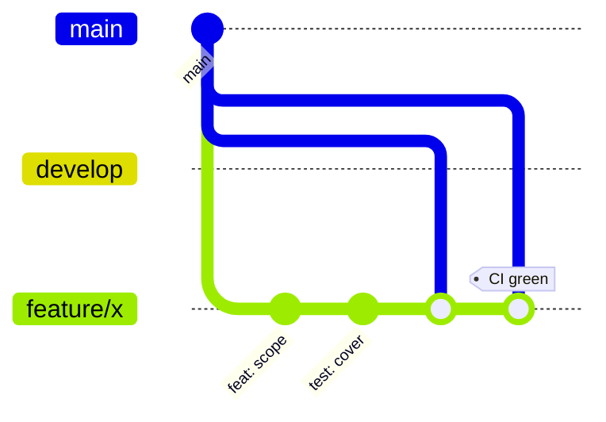

# Development Guidelines

<cite>
- [fullstack/Backend/composer.json](file://fullstack/Backend/composer.json#L44-L62)
- [.github/workflows/ci.yml](file://.github/workflows/ci.yml#L10-L25)
- [fullstack/Backend/app/Providers/AppServiceProvider.php](file://fullstack/Backend/app/Providers/AppServiceProvider.php)
- [fullstack/Backend/tests/TestCase.php](file://fullstack/Backend/tests/TestCase.php)
</cite>

## Table of Contents

1. [Ground Rules](#ground-rules)
2. [Backend Conventions](#backend-conventions)
3. [Validation & Responses](#validation--responses)
4. [Authorization Checklist](#authorization-checklist)
5. [Testing Standards](#testing-standards)
6. [Frontend Conventions](#frontend-conventions)
7. [Git & CI Workflow](#git--ci-workflow)
8. [Definition Of Done](#definition-of-done)

## Ground Rules

1. **Spec before code** for features spanning more than one module.
2. **Thin controllers**: FormRequest in → Service call → Resource out. No Eloquent in controllers.
3. **Interfaces for anything swappable** (gateways, repositories); bindings centralized in `AppServiceProvider`.
4. **Enums over magic strings** — see `app/Enums` and `app/Support/Enums` (`CheckoutType`, `OrderStatus`, `BudgetTier`, …).
5. **Never write credentials into code or docs**; everything flows through `.env`.

## Backend Conventions

- Namespace mirrors domain: `App\{Module}\...` with modules Account / Catalog / Trips / Commerce / Chat / System.
- Repositories implement `app/Interfaces/<Module>/*RepositoryInterface`; keep queries (filters, eager loads) there.
- Domain state machines (orders, subscriptions, agency assignments) throw `InvalidStateTransitionException` instead of silent no-ops.
- Side effects belong in listeners/jobs, not inline in services: payment fulfilment, mails, notifications, report generation.
- Scheduled housekeeping lives as console commands under `app/Console/Commands`.

## Validation & Responses

- One FormRequest per write action (`StoreHotelRequest`, `InitiateCheckoutRequest`, `AiTripRequest`, …) — reuse across alias routes rather than duplicating rules.
- Always return API Resources; wrap envelopes with `Support/ApiResponse`; use `Support/Constants/StatusCode` for codes.
- Error shape unified by `ApiExceptionHandler` (maps `InvalidStateTransitionException`, auth, throttle cases).

## Authorization Checklist

For every new route confirm:

- [ ] Public by design? else `auth:api`
- [ ] Needs verified email? add `verified`
- [ ] Blocked users handled? `EnsureUserIsActive`
- [ ] Permission string exists in `RoleAndPermissionSeeder`? add if missing + audit doc row
- [ ] Fine-grained ownership? Policy (`TripPolicy`, `ConversationPolicy`, …)
- [ ] Rate limiter for abuse-prone endpoints (weather/maps/AI/contact patterns)

Update [`docs/ROUTES-PERMISSIONS-AUDIT.md`](file://fullstack/Backend/docs/ROUTES-PERMISSIONS-AUDIT.md) when the matrix changes.

## Testing Standards

- Feature tests per capability area mirroring module dirs (`tests/Feature/{Account,Catalog,Commerce,System,Trips}`).
- Name tests after behaviour (`PaymentSensitiveDataTest`, `ForkAuthorizationTest`, `SubscriptionUniquenessTest`) — read like a spec index.
- Abuse/security cases are first-class: throttling, blocked users, mass-assignment, concurrency (`ConcurrencyTest`).
- Run locally with `php artisan test`; CI enforces Pint style first.

## Frontend Conventions

- One HTML page = one JS module; shared behaviour goes through `js/common.js` helpers (`apiFetch`, toasts, session guard).
- No new frameworks/bundlers; ES5-safe syntax preferred for maximum browser reach.
- Style with existing tokens/classes from `css/common.css` before adding new CSS.
- Auth token key is canonical: `itinera_token` via `window.Itinera`.

## Git & CI Workflow

- Branches: `main`, `develop`, feature branches; CI triggers on pushes to main/develop/community-hub and PRs into main/develop ([ci.yml](file://.github/workflows/ci.yml#L3-L8)).
- Commit style follows conventional commits (`feat:`, `fix:`, phase prefixes historically used).
- Pint must pass (`vendor/bin/pint --test`) before PR merge.

## Definition Of Done

1. Feature tests green locally and in CI.
2. Routes added to audit matrix + Postman export refreshed (`php artisan export:postman`) when endpoints change.
3. Scramble docs accurate (docblocks updated).
4. No direct DB writes from controllers; side effects evented/queued.
5. Frontend pages keyboard-reachable and functional without JS where core content is concerned.
