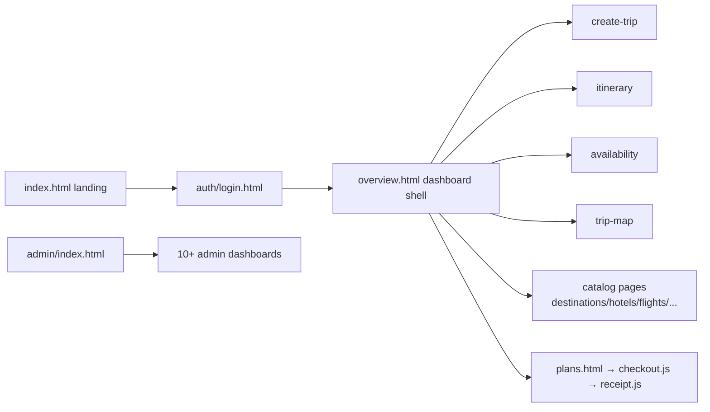

# Frontend Application

<cite>
- [fullstack/Frontend/js/common.js](file://fullstack/Frontend/js/common.js#L1-L30)
- [fullstack/Frontend/index.html](file://fullstack/Frontend/index.html)
- [fullstack/Frontend/css](file://fullstack/Frontend/css)
- [fullstack/Frontend/admin](file://fullstack/Frontend/admin)
- [fullstack/Frontend/README.md](file://fullstack/Frontend/README.md)
</cite>

## Table of Contents

1. [Application Shape](#application-shape)
2. [Page Inventory](#page-inventory)
3. [Shared Core (`common.js`)](#shared-core-commonjs)
4. [Module Map](#module-map)
5. [Styling System](#styling-system)
6. [Admin Suite](#admin-suite)
7. [Conventions For New Pages](#conventions-for-new-pages)

## Application Shape

The frontend is a **multi-page vanilla JS application**: one HTML file per screen, no SPA router, no bundler for the public pages. Each page pulls shared CSS/JS plus its own module. This keeps deployment to any static host trivial (nginx container in this repo).

**Diagram sources:** [page tree](file://fullstack/Frontend/index.html), [js tree](file://fullstack/Frontend/js)

## Page Inventory

| Group | Pages |
|---|---|
| Public marketing | `index.html`, `about.html`, `contact.html`, `help.html`, `explore.html`, `weather.html` |
| Auth | `auth/` (login/register/forgot/social completion) |
| Catalog browse | `destinations.html`, `hotels.html`, `flights.html`, `restaurants.html`, `attractions.html`, `countries.html` + `-details` counterparts, `search.html` |
| Trip planner | `overview.html`, `create-trip.html`, `itinerary.html`, `availability.html`, `trip-map.html`, `trip.html`, `copy-wizard.html` |
| Commerce | `plans.html`, `plan-compare.html`, checkout/receipt flows |
| Community | `entity.html`, agency portal under `agency/` |
| Errors | `403.html`, `404.html`, `500.html`, `errors/` |

**Section sources:** [Frontend root listing](file://fullstack/Frontend/index.html)

## Shared Core (`common.js`)

Key exports from the IIFE ([common.js](file://fullstack/Frontend/js/common.js#L1-L250)):

- `API_BASE` resolution — `TP_CONFIG.apiBase` override, else `http://127.0.0.1:8000/api`.
- `apiFetch(path, options)` — single fetch wrapper adding JWT header, JSON handling, unified error toasts.
- Session guard — delegates to canonical Itinera stack (`window.Itinera`, token key `itinera_token`); unauthenticated users bounced to login.
- Sidebar nav definition (Overview, Create Trip, Itinerary, Availability, Trip Map, Copy Wizard).
- Toast system, currency/date formatters.

## Module Map

| Module | Owns |
|---|---|
| `index.js`, `overview.js` | landing hero, KPI counters, GSAP timelines |
| `catalog-*.js` (+ `catalog-common.js`) | list/detail/browse patterns per entity |
| `create-trip.js`, `itinerary.js`, `trip-map.js`, `copy-wizard.js` | planner screens incl. map view |
| `availability.js` | calendar/flight availability |
| `plans-core.js`, `plans.js`, `plan-compare.js` | subscription plans UX |
| `checkout.js`, `receipt.js` | PayMob hosted-checkout handoff + post-payment receipt |
| `chat.js` | conversation UI |
| `surveys-core.js`, `survey-*.js` | survey create/answer/show |
| `app.js`, `help.js` | misc app chrome |

**Section sources:** [js tree](file://fullstack/Frontend/js)

## Styling System

- Global sheets: [`common.css`](file://fullstack/Frontend/css/common.css) (tokens, layout, sidebar/topbar, glassmorphism navbar), page sheets per feature (`index.css`, `catalog.css`, `itinerary.css`, …), components under `css/components/`.
- Design language: onyx glassmorphism boarding-pass aesthetic, gold/emerald accents on dark, GSAP entrance choreography, 4K photography assets under `assets/`.

## Admin Suite

`admin/index.html` shells 10+ dashboards (Users, Trips, Reviews, Analytics, CRUD catalogs, Settings, Reports, Contacts, Flags, Agency requests). All consume the same `/api` endpoints with role-gated responses (`permission:*`, `role:*`).

## Conventions For New Pages

1. Copy an existing sibling page as skeleton; keep `<head>` asset order identical.
2. Add one `js/<feature>.js` module; register nav entry in `common.js` NAV if it belongs in the app shell.
3. Use `apiFetch` — never raw `fetch` — so auth/error/toast handling stays uniform.
4. Style via existing tokens/classes first; add page CSS only for layout unique to the screen.
