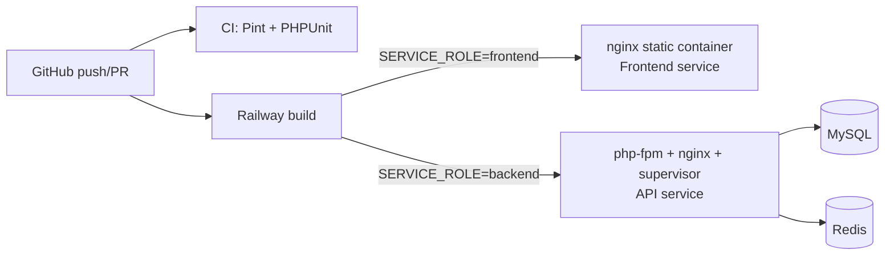

# Infrastructure

<cite>
- [Dockerfile](file://Dockerfile#L1-L121)
- [railway.json](file://railway.json#L1-L15)
- [.github/workflows/ci.yml](file://.github/workflows/ci.yml#L1-L48)
- [fullstack/Frontend/nginx.conf](file://fullstack/Frontend/nginx.conf)
- [fullstack/Frontend/entrypoint.sh](file://fullstack/Frontend/entrypoint.sh)
</cite>

## Table of Contents

1. [Deployment Topology](#deployment-topology)
2. [Dual-Role Dockerfile](#dual-role-dockerfile)
3. [Railway Configuration](#railway-configuration)
4. [Continuous Integration](#continuous-integration)
5. [Health Checks & Runtime Guards](#health-checks--runtime-guards)

## Deployment Topology



**Diagram sources:** [railway.json](file://railway.json#L1-L14), [ci.yml](file://.github/workflows/ci.yml#L3-L8), [Dockerfile final stage](file://Dockerfile#L120-L121)

## Dual-Role Dockerfile

One root `Dockerfile`, three stages:

1. **`frontend` stage** — `nginx:1.27-alpine`; copies `fullstack/Frontend/` into the web root plus its `nginx.conf` and `entrypoint.sh`. Entrypoint can rewrite the API base URL into served config at boot.
2. **`vendor` stage** — `php:8.5-fpm-alpine`; installs composer deps with `--no-dev --optimize-autoloader` for layer caching.
3. **`backend` stage** — php-fpm + nginx under **supervisor** (web + queue worker in one container), production `php.ini`, app overrides from [`fullstack/Backend/docker/php.ini`](file://fullstack/Backend/docker/php.ini), storage dirs provisioned and chowned to www-data.

Final line `FROM ${SERVICE_ROLE}` selects the variant — Railway injects the per-service env var as a build arg.

Extension notes baked into the image: gd/zip/bcmath/pdo_mysql/mbstring/exif/pcntl compiled; **no ext-redis** (predis is pure PHP; pecl redis fails on PHP 8.5).

**Section sources:** [Dockerfile](file://Dockerfile#L10-L121)

## Railway Configuration

```json
{ "build": { "builder": "DOCKERFILE", "dockerfilePath": "Dockerfile", "buildEnvironment": "V3" },
  "deploy": { "runtime": "V2", "numReplicas": 1, "sleepApplication": false,
              "restartPolicyType": "ON_FAILURE", "restartPolicyMaxRetries": 10 } }
```

Single replica, never sleeps (webhooks must always land), restart-on-failure up to 10 attempts.

**Section sources:** [railway.json](file://railway.json#L1-L15)

## Continuous Integration

[`.github/workflows/ci.yml`](file://.github/workflows/ci.yml) runs two jobs on pushes to `main`/`develop`/`feat/community-hub` and PRs to `main`/`develop`:

| Job | Steps |
|---|---|
| **Code Style (Pint)** | setup-php 8.2 → `composer install` → `vendor/bin/pint --test` |
| **PHPUnit Tests** | setup-php 8.2 (+ mbstring, pdo_sqlite, dom, gd, intl, zip) → env bootstrap (`key:generate`, `jwt:secret`) → `php artisan test` |

Tests run on SQLite — no database service container required.

## Health Checks & Runtime Guards

| Surface | Mechanism |
|---|---|
| Frontend container | `HEALTHCHECK`: wget `/` every 30s ([Dockerfile#L19-L20](file://Dockerfile#L19-L20)) |
| Backend container | `HEALTHCHECK`: curl `/up` expecting `"status":"ok"`; generous 60s start period for migrations warm-up |
| Supervisor | keeps php-fpm, nginx and queue worker alive inside backend image ([supervisord.conf](file://fullstack/Backend/docker/supervisord.conf)) |
| Scheduled expiry | console commands `expire:stale-orders`, `expire:stale-subscriptions`, `expire:password-tokens` intended for cron/scheduler |

**Section sources:** [Dockerfile healthchecks](file://Dockerfile#L19-L20), [docker configs](file://fullstack/Backend/docker)
