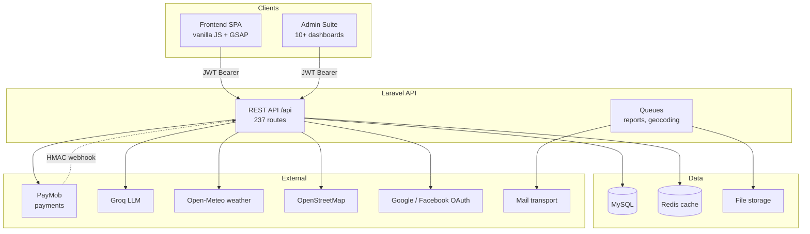

# Itinera — System Overview

> **RepoWiki root page** · Team 2 Conference Case Study — Global Luxury Travel & Trip Planning Platform

<cite>
- [README.md](file://README.md#L1-L30)
- [fullstack/Backend/composer.json](file://fullstack/Backend/composer.json#L8-L23)
- [Dockerfile](file://Dockerfile#L1-L25)
- [railway.json](file://railway.json#L1-L15)
- [fullstack/Backend/routes/api.php](file://fullstack/Backend/routes/api.php#L1-L58)
</cite>

## Table of Contents

1. [What Is Itinera](#what-is-itinera)
2. [Monorepo Layout](#monorepo-layout)
3. [Core Capability Map](#core-capability-map)
4. [System Context Diagram](#system-context-diagram)
5. [Key Numbers](#key-numbers)
6. [Where To Go Next](#where-to-go-next)

## What Is Itinera

Itinera is an end-to-end luxury travel orchestration platform built as a **fullstack monorepo** for the Team 2 conference case study. It combines:

- A **Laravel REST API** (`fullstack/Backend`) with 237 registered routes covering auth, catalog, trips, commerce, chat, and system services.
- A **vanilla JavaScript web app** (`fullstack/Frontend`) with a boarding-pass aesthetic, ~35 static HTML pages, and zero build step for the public site.
- **Payments** via PayMob (hosted checkout + HMAC-verified webhooks).
- **AI features** via Groq LLM (itinerary generation, review, enhancement, concierge) with per-user quota tracking.
- **Executive reporting** via DomPDF / OpenSpout with queued generation.
- **Live weather** via Open-Meteo, cached in Redis.

**Section sources:** [README.md](file://README.md#L11-L44)

## Monorepo Layout

```text
Team2-Conference-Project/
├── fullstack/
│   ├── Backend/      # Laravel API (PHP, JWT, MySQL, Redis, PayMob, Groq)
│   └── Frontend/     # Vanilla JS app (HTML5, CSS3, GSAP, no framework)
├── database/         # Root-level auxiliary DB assets
├── docs/             # Project-level documents
├── tasks/            # Sprint/task notes
├── .github/workflows # CI (Pint lint + PHPUnit)
├── Dockerfile        # Dual-role image: SERVICE_ROLE=frontend|backend
└── railway.json      # Railway deployment descriptor
```

The single root `Dockerfile` builds **either** a nginx static frontend **or** a php-fpm + nginx + supervisor backend depending on the `SERVICE_ROLE` build argument — one repo, two deployable Railway services.

**Section sources:** [README.md](file://README.md#L15-L23), [Dockerfile](file://Dockerfile#L8-L25), [railway.json](file://railway.json#L1-L14)

## Core Capability Map

| Domain | Backend module | Highlights |
|---|---|---|
| Account | `app/Http/Controllers/Account` | JWT auth, refresh rotation, email verification, social login (Google/Facebook), admin user management |
| Catalog | `app/Http/Controllers/Catalog` | Countries, cities, destinations, hotels, flights, restaurants, attractions, stats; fixture seeding |
| Trips | `app/Http/Controllers/Trips` | CRUD, itinerary items, attach/detach, fork, AI generate/review/enhance, maps, reviews |
| Commerce | `app/Http/Controllers/Commerce` | Plans/subscriptions, checkout strategies, PayMob gateway + webhook, agency marketplace |
| Chat | `app/Http/Controllers/Chat` | Conversations + messages between users |
| System | `app/Http/Controllers/System` | Weather, reports (PDF/XLSX), settings, surveys, contact/newsletter, flags, notifications, dashboard |

**Section sources:** [fullstack/Backend/routes/api.php](file://fullstack/Backend/routes/api.php#L56-L499)

## System Context Diagram



**Diagram sources:** [routes/api.php](file://fullstack/Backend/routes/api.php#L60-L498), [composer.json](file://fullstack/Backend/composer.json#L8-L22), [config/services.php](file://fullstack/Backend/config/services.php#L59-L62)

## Key Numbers

| Metric | Value | Source |
|---|---|---|
| API routes | 237 | `rg -c "Route::" routes/api.php` |
| Migrations | 44 files | `database/migrations` |
| Seeders | 34 classes + JSON fixtures | `database/seeders` |
| Feature/unit tests | 50+ test classes | `tests/Feature`, `tests/Unit` |
| Frontend pages | ~35 HTML pages (+ admin/, agency/, auth/) | `fullstack/Frontend` |
| Frontend JS modules | 33 files under `js/` | `fullstack/Frontend/js` |

**Section sources:** repository tree inspection, 2026-08-23 @ commit `0c14fa54`.

## Where To Go Next

- New to setup → [Getting Started Guide](Getting%20Started%20Guide.md)
- How layers fit together → [Architecture Overview](Architecture/Architecture.md)
- Stack versions & rationale → [Technology Stack](Architecture/Technology%20Stack%20%26%20Architecture.md)
- Service internals → [Backend Services](Backend%20Services/Backend%20Services.md)
- UI structure → [Frontend Application](Frontend%20Application.md)
- Deployment & CI → [Infrastructure](Infrastructure.md)
- Endpoint catalogue → [API Reference](API%20Reference.md)
