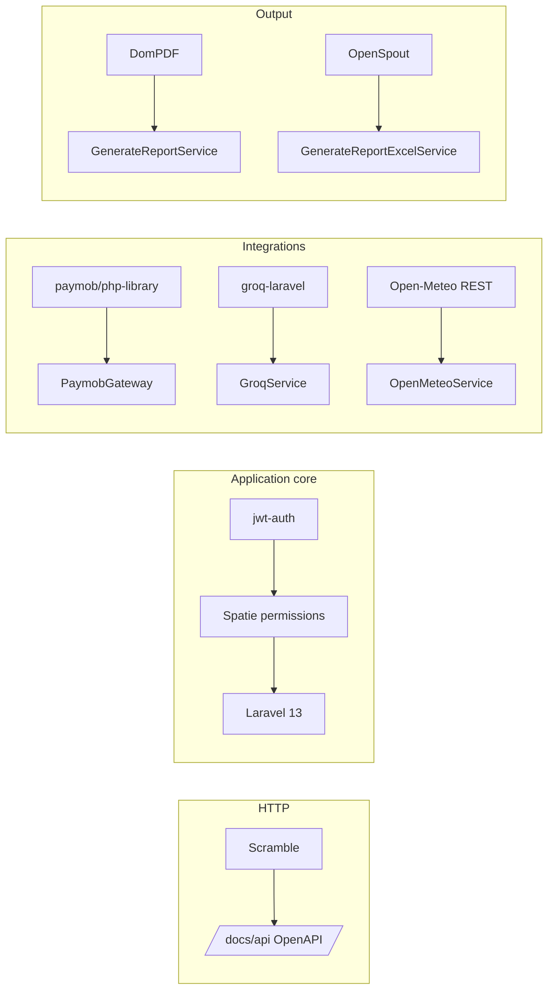
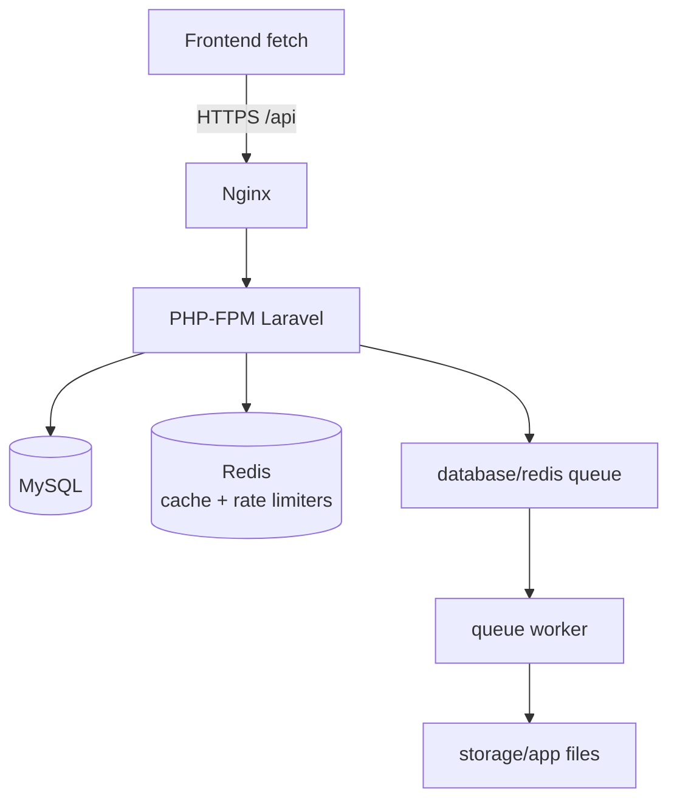

# Technology Stack & Architecture

<cite>
- [fullstack/Backend/composer.json](file://fullstack/Backend/composer.json#L8-L31)
- [Dockerfile](file://Dockerfile#L27-L121)
- [fullstack/Backend/config/services.php](file://fullstack/Backend/config/services.php#L59-L62)
- [fullstack/Frontend/js/common.js](file://fullstack/Frontend/js/common.js#L1-L30)
</cite>

## Table of Contents

1. [Stack At A Glance](#stack-at-a-glance)
2. [Backend Libraries And Why They Are There](#backend-libraries-and-why-they-are-there)
3. [Frontend Stack](#frontend-stack)
4. [Data & Caching Topology](#data--caching-topology)
5. [Version Notes And Gotchas](#version-notes-and-gotchas)

## Stack At A Glance

| Layer | Technology | Version constraint |
|---|---|---|
| Language | PHP | composer `^8.5` · CI 8.2 · Docker image 8.5-fpm-alpine |
| Framework | Laravel | `^13.0` |
| Auth | tymon/jwt-auth + Laravel Socialite | `^2.1` / `*` |
| RBAC | spatie/laravel-permission | `^6.16 || ^8.0` |
| Database | MySQL (prod) · SQLite (tests/local quickstart) | — |
| Cache/Queue backend | Redis via predis | `^2.0 || ^3.0` |
| Payments | paymob/php-library | `^1.0` |
| AI | lucianotonet/groq-laravel → Groq LLM | `^1.0` (model default `llama-3.1-8b-instant`) |
| PDF / Excel | barryvdh/laravel-dompdf · openspout | `^3.1` / `^4.24 || ^5.0` |
| API docs | dedoc/scramble (OpenAPI at `/docs/api`) | `^0.13.36` |
| Testing | PHPUnit `^11–13`, Mockery, Collision | dev |
| Frontend | Vanilla HTML5/CSS3/JS + GSAP 3.12, Tailwind utilities | no build step for pages |

**Section sources:** [composer.json](file://fullstack/Backend/composer.json#L8-L31), [README badges/features](file://README.md#L4-L44)

## Backend Libraries And Why They Are There

**Diagram sources:** [Services tree](file://fullstack/Backend/app/Services), [composer.json](file://fullstack/Backend/composer.json#L8-L22)

Notable choices:

- **Scramble** generates interactive docs from controller docblocks — no manual spec maintenance ([README](file://README.md#L38)).
- **predis over ext-redis**: the Docker build deliberately skips `pecl redis` because it fails against PHP 8.5; predis needs no extension ([Dockerfile comment](file://Dockerfile#L85-L87)).
- **DomPDF + OpenSpout** pair covers branded executive PDFs and spreadsheet exports with "All Time" default filtering.

## Frontend Stack

- Plain ES5-flavoured modules under [`js/`](file://fullstack/Frontend/js) loaded per page; shared core [`common.js`](file://fullstack/Frontend/js/common.js#L1-L30) exposes session guard, `apiFetch` wrapper around `API_BASE`, sidebar nav, toasts, formatters.
- Session token stored under key `itinera_token` via the canonical Itinera config/api/session stack (`window.Itinera`).
- Design system CSS lives in [`css/`](file://fullstack/Frontend/css) (`common.css`, `index.css`, page-specific sheets + `css/components/`); GSAP drives hero timelines, tilt micro-interactions, KPI counters.
- Weather radar carousel consumes `/weather` (Open-Meteo backed) for 17+ cities.

**Section sources:** [Frontend README](file://fullstack/Frontend/README.md), [js tree](file://fullstack/Frontend/js), [css tree](file://fullstack/Frontend/css)

## Data & Caching Topology

Redis backs cache keys declared in [`Support/Constants/CacheKeys.php`](file://fullstack/Backend/app/Support/Constants/CacheKeys.php), throttle limiters (`throttle:weather|maps|ai|login…`), and AI quota counters (`AiUsageService`).

**Diagram sources:** [CacheKeys.php](file://fullstack/Backend/app/Support/Constants/CacheKeys.php), [routes throttle usage](file://fullstack/Backend/routes/api.php#L67-L89)

## Version Notes And Gotchas

| Symptom | Cause | Fix guidance |
|---|---|---|
| Composer platform errors locally | `"php": "^8.5"` requirement vs local 8.2 | run inside Docker or adjust platform check consciously |
| Redis features silently off | `CACHE_DRIVER=array` fallback | set redis driver for quota/throttle correctness in tests that assert it |
| Scramble docs stale | cached annotations | clear config/route caches after controller edits |
| GSAP animations missing | CDN blocked offline | pages degrade gracefully; verify network or vendor locally |
